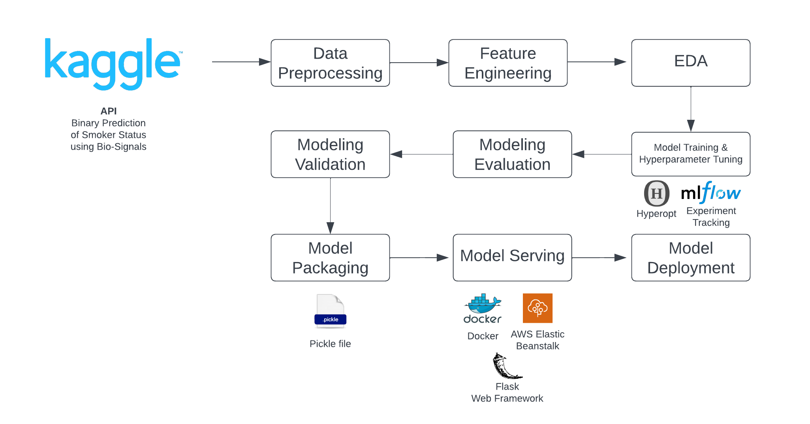
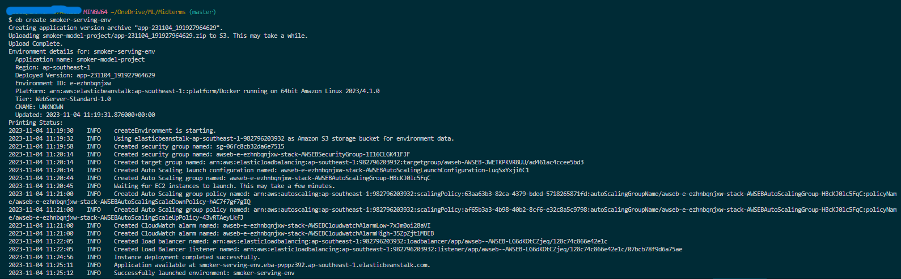
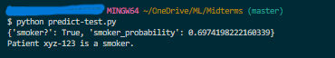

# Smoker Signals: a Machine Learning Project for DataTalksClub ML Zoomcamp



## Problem Description

- This project aims to use binary classification to predict a patient's smoking status given information about various other health indicators.

## Exploratory Data Analysis
- EDA can be found in the `notebook.ipynb` file
- Feature Engineering yielded 3 additional columns:
    - `cholesterol_ratio`, `de_ritis_ratio`, `bmi_class`
- EDA involves:
    - Range of values
    - Distribution of data in numerical Columns
    - Checking for missing values and duplicate rows
    - Analysis of Target Variable
        - Distribution of smokers among:
            - ages
            - weights
            - cholesterol ratio
            - de ritis ratio
            - BMI Class
            - dental caries
    - Feature Importance
    - Correlation
## Model training
- Total number of features: 23 (5: categorical, 18: numerical)
- Categorical columns
    ```
    'hearing(left)',
    'hearing(right)',
    'Urine protein',
    'dental caries',
    'bmi_class'
    ```
- Numerical columns
    ```
    'age', 'waist(cm)', 'eyesight(left)', 'eyesight(right)', 'systolic', 'relaxation', 'fasting blood sugar', 'Cholesterol', 'triglyceride','HDL', 'LDL', 'hemoglobin', 'serum creatinine', 'AST', 'ALT', 'Gtp', 'cholesterol_ratio', 'de_ritis_ratio'
    ```
- Baseline Models:
    ```
    'LogisticRegressor': LogisticRegression(random_state=42),
    'RandomForestClassifier': RandomForestClassifier(random_state=42),
    'DecisionTreeClassifier': DecisionTreeClassifier(random_state=42),
    'XGBClassifier': XGBClassifier(seed=42),
    'LGBM': LGBMClassifier(random_state=42)
    ```
- Hypertuned Models:
    - Hypertuning was automated using `HyperOpt`
    - Experiment Tracking was performed in `MLFlow`
    ```
    XGBClassifier
    LGBMClassifier
    RandomForestClassifier
    ```
- Best model based on AUC:
    ```
    XGBClassifier

    params={
    'booster': 'gbtree',
    'learning_rate': 0.013310002716978346,
    'max_depth': 50,
    'min_child_weight': 75.38444619706124,
    'n_estimators': 483,
    'objective': 'binary:logistic',
    'random_state': 42,
    }
    ```

## Exporting notebook to script
- The logic for training the model is exported to a separate script: `train.py`

## Model deployment
- Model is served through Flask web framework.
## Dependency and environment management
- Pipenv was used as a virtual environment. Pipfile and Pipfile.lock contains the dependencies. 
- Steps in setting up the environment and the application is dockerized.
## Containerization
- The application is containerized. To run the this project, follow the steps in [Reproducibility - Local](#to-run-the-docker-container-locally).
## Cloud deployment
- This app can also be deployed in `AWS Elastic Beanstalk` following the steps in [Reproducibility - Cloud](#to-deploy-and-run-the-app-using-cloud).
- There's a [screenshot (at Step 6)](#to-deploy-and-run-the-app-using-aws-elastic-beanstalk) of testing it

## Reproducibility
- You can re-execute the `notebook.py` using Google Colab
- It is possible to re-execute `train.py` since the dataset `train.csv` is present in this repo:
    - Clone the repo and move to the repo directory to use the `Makefile`
        ```
        git clone https://github.com/rbblmr/smoker-signals.git
        
        cd smoker-signals
        ```
    - Activate pipenv:
        ```
        pipenv shell
        ```
    - Although the model is already present in the repo, you can try running the training script:
        ```
        python train.py
        ```

### To run the docker container locally:
- Prerequisites:
    - Running docker or docker desktop
    - (If not yet done) Activate `pipenv shell` at the directory where repo was cloned.
    
1. Build the image. This takes around 5 minutes:
        
        make build

2. Run the container:

        make run

3. Test the app. In another terminal at the same directory, you can test the application:
    - Make sure to `pipenv shell` so you can use `make`
    ```
    make test-local
    ```


4. Shut down the container by CTRL+C.

###  To deploy and run the app using AWS Elastic Beanstalk:

- Prerequisites:
    - AWS account
    - AWS access id and key
    - (If not yet done) Activate `pipenv shell` at the directory where repo was cloned

1. To create a project in elastic beanstalk and create the environment for the app (you'll be prompted to enter your access id and key, if you haven't configured awsebcli before):

        make deploy

2. Copy the `application url` after the process outputs: 
    
        INFO    Application available at `application-url`
        INFO    Successfully launched environment: smoker-serving-env

3. Change the `host` variable in `predict-test-cloud.py`.

4. Test the app. In another terminal at the same directory, you can test the application:
    - Make sure to `pipenv shell` so you can use `make`
    ```
    make test-cloud
    ```
5. Terminate the app after use:

    ```
    make terminate-app
    ```

6. Expected results:
    - Creating the smoking-server-env and the application

        

    - Result of running the test script

        